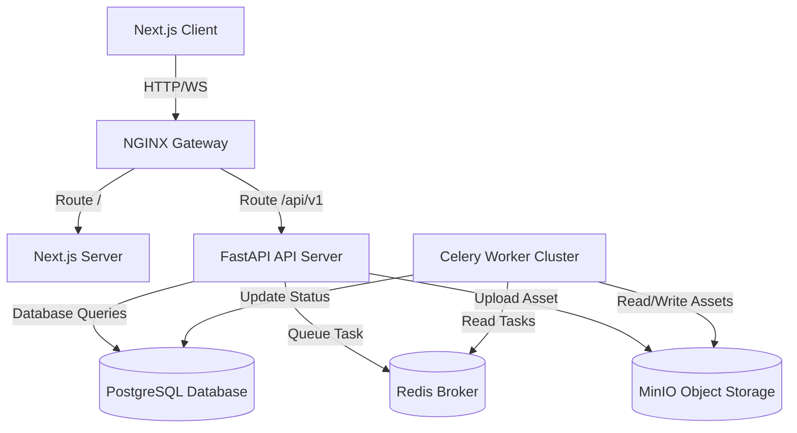

# Aetheria AI Video Platform

Aetheria AI is a world-class, production-ready AI Video Generation Platform featuring Text-to-Video, Image-to-Video, and Video-to-Video capabilities. Built with a robust, decentralized GPU queue architecture, it supports scalable generation pipelines for enterprise applications.

---

## Technical Architecture



### Technology Stack

* **Frontend**: Next.js 16 (App Router), React 19, TypeScript, Tailwind CSS v4, Zustand, Framer Motion, Lucide Icons.
* **Backend**: Python FastAPI, SQLAlchemy (PostgreSQL / SQLite support), JWT & OAuth2, Bcrypt password hashing.
* **Task Queue**: Celery, Redis Broker/Backend.
* **Storage & Proxy**: MinIO (S3-compatible bucket storage), NGINX reverse-proxy / gateway router.
* **Infrastructure**: Docker, Docker Compose, GitHub Actions CI Pipeline.

---

## Directory Structure

```text
├── .github/workflows/    # CI pipelines
│   └── ci.yml            # Lint, test, and docker build checks
├── backend/              # Python FastAPI service
│   ├── app/              # Application logic
│   │   ├── auth.py       # Authentication & JWT verification
│   │   ├── celery_app.py # Celery initialization
│   │   ├── config.py     # BaseSettings configuration
│   │   ├── database.py   # Connection pool
│   │   ├── main.py       # API routing and middleware
│   │   ├── models.py     # SQLAlchemy DB entities
│   │   ├── schemas.py    # Request/Response schemas
│   │   └── tasks.py      # Celery task pipeline simulation
│   ├── docs/             # API specifications
│   │   └── openapi.json  # Auto-generated OpenAPI JSON
│   ├── scripts/          # Developer tooling scripts
│   │   └── dump_openapi.py
│   ├── tests/            # Pytest test suite
│   ├── Dockerfile
│   └── requirements.txt
├── frontend/             # Next.js web application
│   ├── app/              # App router pages & styles
│   │   ├── components/   # UI components
│   │   ├── dashboard/    # User workstation panel
│   │   ├── globals.css   # Tailwinds and theme classes
│   │   ├── layout.tsx    # Layout and variables
│   │   ├── store.ts      # Zustand client state store
│   │   └── page.tsx      # Landing page & auth card
│   ├── public/           # Static asset assets
│   ├── Dockerfile
│   └── package.json
├── docker-compose.yml    # Full service configurations
├── nginx.conf            # NGINX gateway configuration
└── README.md
```

---

## Quick Start (Docker Compose)

The easiest way to run the entire stack (including Postgres, Redis, MinIO, NGINX, FastAPI, and Next.js) is via Docker Compose:

```bash
docker compose up --build
```

* **Frontend Panel**: [http://localhost](http://localhost) (routed via NGINX port 80)
* **Backend Docs (Swagger)**: [http://localhost/docs](http://localhost/docs)
* **Object Storage Console**: [http://localhost:9001](http://localhost:9001) (User: `minioadmin` / Pass: `minioadmin`)

---

## Local Development Setup

If you prefer to run services locally outside containers:

### 1. Backend Setup
Make sure you have Python 3.10+ installed.

```bash
cd backend
python3 -m venv venv
source venv/bin/activate
pip install -r requirements.txt
```

Run database migrations & start the API server:
```bash
# Set DATABASE_URL override to use local SQLite for quick tests
DATABASE_URL=sqlite:///./test.db uvicorn app.main:app --reload --port 8000
```

Start the Celery worker (requires Redis running locally on port 6379):
```bash
celery -A app.celery_app worker --loglevel=info
```

### 2. Frontend Setup
Make sure you have Node.js 18+ installed.

```bash
cd frontend
npm install
npm run dev
```

The frontend will start on [http://localhost:3000](http://localhost:3000) and redirect API queries to backend on port 8000.

---

## Testing & Validation

### Run Backend Unit Tests
We use Pytest for our test suite. SQLite is used as an in-memory test database.

```bash
cd backend
DATABASE_URL=sqlite:///./test.db venv/bin/pytest
```

### Run Frontend Linting & Compiles
Verify linting standards and build compiler pipelines:

```bash
cd frontend
npm run lint
npm run build
```

---

## License
MIT License. Built for enterprise AI creative platforms.
